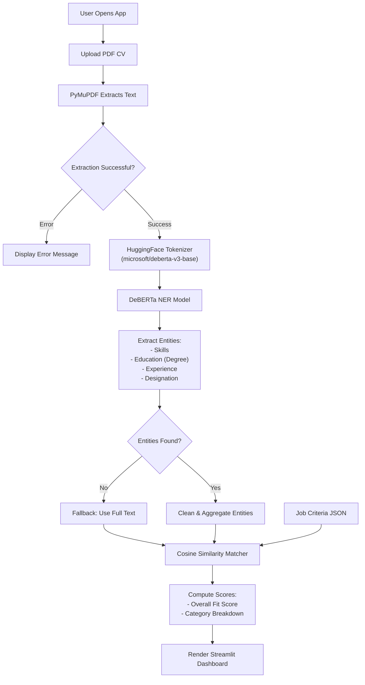

# CV Parser & Job Fit Analyzer

An intelligent resume analysis application that uses deep learning and NLP to extract key entities from CVs and compute job fit scores. The system utilizes a fine-tuned DeBERTa-v3-base model for Named Entity Recognition (NER) and cosine similarity for job matching. Users can upload PDF resumes and instantly receive an AI-driven fit analysis against job requirements.

## Table of Contents

- [Architecture Overview](#architecture-overview)
- [Application Flow](#application-flow)
- [AI & Machine Learning](#ai--machine-learning)
- [Technology Stack](#technology-stack)
- [Features](#features)
- [Dataset](#dataset)
- [Prerequisites](#prerequisites)
- [Installation Steps](#installation-steps)
- [Running the Application](#running-the-application)
- [Project Structure](#project-structure)

## Architecture Overview

The application follows a streamlined pipeline architecture:

```
┌─────────────────────────────────────────────────────────────────┐
│                        USER INTERFACE (Streamlit)               │
│  - PDF Upload                                                   │
│  - Results Dashboard (Metrics & Progress Bars)                  │
└────────────────┬────────────────────────────────────────────────┘
                 │
                 │ Passes raw PDF byte stream
                 ▼
┌─────────────────────────────────────────────────────────────────┐
│                    TEXT EXTRACTION MODULE                       │
│  - PyMuPDF (fitz)                                               │
│  - Extracts and cleans raw text from PDF files                  │
└────────────────┬────────────────────────────────────────────────┘
                 │
                 │ Passes raw text string
                 ▼
┌─────────────────────────────────────────────────────────────────┐
│                    NER & SCORING MODULE                         │
│  - Fine-tuned DeBERTa-v3-base                                   │
│  - Tokenizes and extracts Skills, Education, Experience         │
│  - Computes Cosine Similarity against Job Requirements          │
└─────────────────────────────────────────────────────────────────┘
```

## Application Flow



## AI & Machine Learning

### 1. DeBERTa-v3-base NER Model

#### What is DeBERTa?
DeBERTa (Decoding-enhanced BERT with disentangled attention) improves upon standard BERT/RoBERTa architectures by using disentangled attention and an enhanced mask decoder.

**Training Methodology**:
```python
Base Model: microsoft/deberta-v3-base
├── Frozen layers: Pre-trained contextual embeddings
├── Custom head: Token Classification (Linear Layer)
└── Output: 9 Token Classes (B-I format for 4 entities + O)
```

**Training Configuration**:
- **Max Epochs**: 40 (with Early Stopping patience of 4)
- **Learning Rate**: 3e-5
- **Max Sequence Length**: 128 Tokens
- **Batch Size**: 8
- **Optimizer**: AdamW
- **Weight Decay**: 0.05
- **Scheduler**: Linear with 10% Warmup
- **Gradient Clipping**: 1.0

**Extracted Entities (Classes)**:
1. Skills
2. Experience
3. Degree (Education)
4. Designation

### 2. Job Fit Scoring

**Methodology**:
Once entities are extracted from the CV, they are compared against pre-defined job requirements using **Cosine Similarity**. 
- Text vectors are created using TF-IDF (Term Frequency-Inverse Document Frequency).
- The dot product of the vectors calculates the semantic alignment between the candidate's extracted profile and the job description.

## Technology Stack

### Frontend & UI
- **Streamlit** - Interactive Python web framework
- **HTML/CSS** - Custom styling via Streamlit Markdown

### AI & NLP
- **PyTorch** - Deep learning framework
- **Hugging Face Transformers** - Model architecture and tokenization
- **Scikit-learn** - TF-IDF Vectorization and Cosine Similarity

### Utilities
- **PyMuPDF (fitz)** - High-speed PDF text extraction
- **NumPy** - Numerical operations
- **Pandas** - Data manipulation

## Features

- **Automated Text Extraction**: Instantly parses text from complex PDF resumes.
- **Deep Learning NER**: Accurately isolates Skills, Experience, Education, and Designations.
- **Semantic Job Matching**: Scores candidate fitness using Cosine Similarity.
- **Granular Dashboard**: Displays an overall fit percentage alongside a detailed categorical breakdown.
- **Robust Fallback Mechanism**: Automatically reverts to full-text semantic scoring if the NER model cannot confidently isolate entities.

## Dataset

### Raw PDF Resume Dataset
- **Source**: Publicly available Resume dataset (e.g., from Kaggle).
- **Total Samples**: Exactly 2,484 real PDF resumes.
- **Categories**: Spans multiple professional domains (Information Technology, HR, Design, Engineering, etc.).

### Custom Annotated Training Set
- **Total Samples**: 220 resumes were randomly sampled from the massive raw dataset.
- **Annotation Method**: Manually labeled to extract specific job-fit entities.
- **Format**: JSON-based BIO tagging scheme specifically structured for NER training.

## Prerequisites

- **Python**: 3.11
- **PyTorch**: 2.0+ (CUDA recommended for training, CPU sufficient for inference)

## Installation Steps

### 1. Environment Setup

**Using Conda (Recommended):**
```bash
conda create -n ner_eval_env python=3.11
conda activate ner_eval_env
```

**Using venv (Without Conda):**
```bash
python -m venv venv
# On Windows:
venv\Scripts\activate
# On Mac/Linux:
source venv/bin/activate
```

### 2. Install Dependencies
```bash
pip install -r requirements.txt
```

### 3. Run Web App
```bash
streamlit run app.py
```

## Project Structure

```
cv-parser/
├── app.py                      # Main Streamlit application
├── model_ner_v2.py             # PyTorch model architecture definition
├── job_fit_scoring.py          # TF-IDF & Cosine Similarity logic
├── read_pdf.py                 # PyMuPDF extraction wrapper
├── preprocess_training_v2.py   # Dataset loading and BIO tagging prep
├── train.vfinal-final.py       # Core training loop and evaluation
├── requirements.txt            # Python dependencies
└── cv/                         # Directory for raw PDF inputs
```
